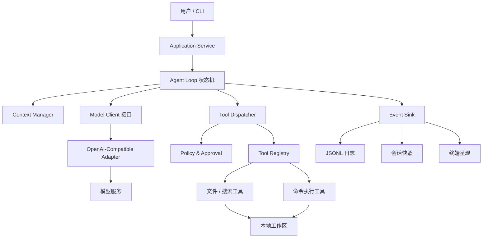
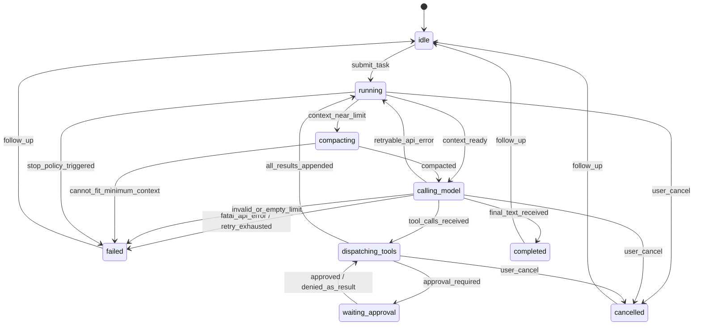
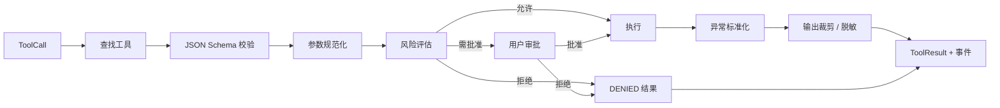

# CodeYF 系统设计说明书

文档版本：1.0  
对应需求：[需求规格说明书](./01-requirements.md)

## 1. 设计目标与原则

CodeYF 采用“薄模型适配层 + 显式状态机 + 本地工具内核”的设计。大语言模型负责提出下一步动作，宿主程序负责验证、授权、执行和记录动作。任何模型输出都不能绕过工具层直接作用于本机。

核心设计原则如下：

1. **模型不可信**：路径、命令、JSON 参数和工具输出中的指令都按不可信输入处理。
2. **副作用集中**：只有工具执行器可以读写工作区或启动进程。
3. **状态显式**：会话、轮次、审批和停止原因使用类型化状态表示，不用散落的布尔值拼装。
4. **协议隔离**：厂商请求/响应在适配器边界转换为内部消息模型。
5. **失败可回传**：可纠正的错误作为结构化工具结果交回模型，而不是直接令进程崩溃。
6. **边界先于能力**：先完成路径沙箱、审批和超时，再扩展更多工具。
7. **可离线测试**：核心循环可使用脚本化假模型与内存事件仓库完成确定性测试。

覆盖需求：FR-010~014、FR-030~055、NFR-003~006。

## 2. 技术选型

| 类别 | 基线选择 | 说明 |
|---|---|---|
| 语言 | Python 3.11+ | 标准库可覆盖进程、路径、异步和持久化；类型生态完善 |
| CLI | `argparse`（MVP） | 避免非必要依赖；后续可换 Typer，但不进入核心层 |
| HTTP/API | 厂商官方客户端或 `httpx` | 仅用于模型 API，不使用 Agent SDK |
| 数据校验 | `pydantic` 或轻量自研校验 | 用于配置与工具参数；若追求零依赖可替换 |
| 持久化 | JSONL + JSON 快照 | 便于调试、回放和版本迁移 |
| 测试 | pytest | 支持 fixture、参数化和异步测试 |
| 搜索 | 优先 `rg`，内置 Python 回退 | 性能与可移植性兼顾 |

实现不得让框架对象渗入领域模型。例如，OpenAI SDK 的消息类必须在 `OpenAICompatibleAdapter` 内转换，`AgentLoop` 只依赖内部 `ModelClient` 协议。

## 3. 总体架构



调用方向必须从外层指向内层协议；领域层不得导入具体 API 客户端、终端 UI 或文件数据库实现。

## 4. 代码模块与目录

推荐目录结构：

```text
codeyf/
├── pyproject.toml
├── src/codeyf/
│   ├── __main__.py
│   ├── cli.py
│   ├── application.py
│   ├── config.py
│   ├── domain/
│   │   ├── messages.py
│   │   ├── session.py
│   │   ├── events.py
│   │   └── errors.py
│   ├── agent/
│   │   ├── loop.py
│   │   ├── context.py
│   │   ├── prompt.py
│   │   ├── stop_policy.py
│   │   └── repetition.py
│   ├── models/
│   │   ├── base.py
│   │   └── openai_compatible.py
│   ├── tools/
│   │   ├── base.py
│   │   ├── registry.py
│   │   ├── dispatcher.py
│   │   ├── path_guard.py
│   │   ├── read_file.py
│   │   ├── list_files.py
│   │   ├── search_text.py
│   │   ├── apply_patch.py
│   │   └── run_command.py
│   ├── security/
│   │   ├── policy.py
│   │   ├── command_risk.py
│   │   ├── approval.py
│   │   └── redaction.py
│   ├── persistence/
│   │   ├── event_log.py
│   │   └── session_store.py
│   └── presentation/
│       ├── console.py
│       └── json_output.py
├── tests/
│   ├── unit/
│   ├── integration/
│   ├── e2e/
│   └── fixtures/
└── docs/
```

### 4.1 模块职责

| 模块 | 单一职责 | 禁止承担 |
|---|---|---|
| `application` | 组装依赖、启动/恢复会话 | 解析厂商响应、直接执行工具 |
| `agent.loop` | 驱动状态转换和轮次 | 拼接 shell 命令、访问真实文件 |
| `agent.context` | 选择、裁剪、压缩模型输入 | 修改原始事件日志 |
| `models.*` | 内部模型协议与厂商映射 | 执行工具、决定审批 |
| `tools.dispatcher` | 校验、审批、调用、标准化异常 | 包含具体工具业务逻辑 |
| `tools.*` | 一个工具的一项本地能力 | 调用模型 |
| `security.*` | 路径/命令风险判断、审批、脱敏 | 依赖终端以外的业务状态 |
| `persistence.*` | 追加事件、原子保存/加载快照 | 改写领域状态 |
| `presentation.*` | 人类/JSON 输出 | 参与停止条件判断 |

## 5. 核心领域模型

以下为逻辑模型，具体字段契约见接口文档。

### 5.1 消息

- `SystemMessage(content)`：固定安全和行为规则。
- `UserMessage(content)`：用户任务或后续补充。
- `AssistantMessage(content?, tool_calls[])`：模型文本和零到多个工具调用。
- `ToolMessage(tool_call_id, name, result)`：对应一次工具调用的标准化结果。
- `SummaryMessage(content, source_range)`：内部压缩摘要；发送模型时映射为明确标注的 system/developer 上下文块。

内部消息必须使用不可变数据类或禁止随意原地修改。持久化时记录 `schema_version`。

### 5.2 会话

`AgentSession` 包含：

- `session_id`：UUIDv7/UUID4；
- `workspace`：规范绝对路径及稳定指纹；
- `status`：会话状态枚举；
- `messages`：当前有效消息；
- `summary`：可空的历史摘要；
- `turn_count`、`tool_call_count`；
- `started_at`、`updated_at`、`deadline`；
- `last_error`、`stop_reason`；
- `model_config_fingerprint`；
- `next_event_seq`。

会话快照是恢复优化，不是审计真相；JSONL 事件日志是追加式事实记录。

### 5.3 工具调用与结果

`ToolCall` 包含模型调用 ID、工具名和 JSON 参数。`ToolResult` 必须明确成功与失败；失败不是 Python 异常字符串的随意拼接，而是稳定错误码、用户/模型可读消息及安全元数据。

## 6. 智能体状态机



终态针对“一次用户任务”，交互会话可以在终态后接收新消息并回到 `idle/running`。状态转换由 `AgentLoop` 单点负责，并在转换后同步发出事件。

## 7. 主循环设计

### 7.1 伪代码

```python
async def run_task(session: AgentSession, user_text: str) -> RunResult:
    session.append(UserMessage(user_text))
    transition(session, RUNNING)

    while True:
        stop = stop_policy.evaluate(session, clock.now())
        if stop:
            return finish_with_limit(session, stop)

        context = await context_manager.build(session)
        if context.needs_compaction:
            await context_manager.compact(session)
            continue

        response = await model_client.complete(
            messages=context.messages,
            tools=tool_registry.schemas(),
            request_id=new_id(),
        )
        assistant = response_parser.to_internal(response)
        session.append(assistant)

        if assistant.tool_calls:
            for call in assistant.tool_calls:
                repeat_decision = repetition_guard.check(call, session)
                if repeat_decision.must_stop:
                    return finish_failed(session, repeat_decision.reason)
                result = await dispatcher.execute(call, session)
                session.append(ToolMessage.from_result(call, result))
            continue

        if assistant.content and assistant.content.strip():
            return finish_completed(session, assistant.content)

        session.empty_response_count += 1
```

### 7.2 关键不变量

1. 每个执行过的 `ToolCall.id` 恰好对应一个 `ToolMessage.tool_call_id`，包括拒绝和内部错误。
2. Assistant 消息必须先持久化，工具才能执行；工具结果产生后必须立即持久化。
3. 模型网络请求可以重试，已进入执行阶段的工具调用不可因网络错误重放。
4. 同一助手消息内的工具调用保持原顺序，任何工具失败不阻止后续工具被记录；是否继续执行后续调用由策略配置，MVP 默认继续。
5. 状态达到终态后不得再自动调用模型或工具。

### 7.3 停止策略

`StopPolicy` 按以下优先级评估：

1. 用户取消；
2. 总任务时限；
3. 最大模型轮次；
4. 最大工具调用数；
5. 连续空响应；
6. 连续重复无进展；
7. 无法构建最小上下文；
8. 正常最终文本。

推荐默认值：最大模型轮次 30、最大工具调用 100、总时限 30 分钟、连续空响应 2 次、相同失败 3 次。

## 8. 上下文管理设计

覆盖需求：FR-020~024。

### 8.1 输入组成

发送给模型的内容按以下稳定顺序组成：

1. 固定系统提示：角色、工具纪律、安全边界、完成标准；
2. 工作区信息：路径显示名、平台、允许能力、审批模式；
3. 压缩摘要（若存在，明确标记为历史摘要而非新指令）；
4. 尚未压缩的原始消息窗口；
5. 当前循环提醒（仅在需要反思或即将达到限制时加入）。

### 8.2 预算算法

设模型上下文上限为 `C`，预留输出为 `O`，安全余量为 `S`，工具 schema 估算为 `T`，则消息可用预算：

```text
M = C - O - S - T
```

推荐 `S = max(1024, C × 5%)`。token 计算器可用模型 tokenizer；未知模型使用保守字符估算（英文约 4 字符/token，中文约 1.5 字符/token），并乘 1.15 安全系数。

当输入超过 `M × 85%` 时启动压缩，而不是等 API 拒绝。

### 8.3 工具结果裁剪

- 每个工具具有独立默认上限；
- 文本结果优先保留结构化头部、前段和尾段；
- 在省略处插入如 `[... omitted 18,240 chars ...]`；
- 二进制文件不直接解码，返回类型、大小和拒绝原因；
- 命令输出分别裁剪 stdout/stderr，不能把 stderr 丢失在合并流中；
- 完整输出可选择保存到会话工件目录，但路径必须安全且日志中注明；MVP 可不保存。

### 8.4 历史压缩

压缩器输入一段完整边界的旧消息，输出固定模板：

```text
用户目标：
用户约束：
已检查文件：
已完成修改：
验证及结果：
重要错误/观察：
当前待办：
```

永不只保留模型生成的摘要：系统提示、当前用户消息、最近至少 2 轮 assistant/tool 交互保留原文。压缩失败时先裁剪更旧工具结果；仍无法容纳则以 `CONTEXT_EXHAUSTED` 终止。

## 9. 工具系统设计

### 9.1 工具协议

每个工具实现统一协议：

```python
class Tool(Protocol):
    name: str
    description: str
    input_schema: dict[str, object]
    risk: ToolRisk

    async def execute(self, args: Mapping[str, object], ctx: ToolContext) -> ToolResult: ...
```

工具实例不得保存跨会话可变状态。`ToolContext` 提供工作区、取消令牌、超时、输出限制和受控进程运行器。

### 9.2 调度管线



检查顺序不可颠倒：尤其不能先执行再审批，也不能在参数校验前做路径展开或 shell 插值。

### 9.3 文件修改策略

首选 unified diff 形式的 `apply_patch`：

- 工具接收一个补丁字符串；
- 解析所有目标路径并逐一通过 `PathGuard`；
- 在内存中对所有目标文件试应用；
- 任一 hunk 不匹配则整个调用失败；
- 所有目标均成功后，以临时文件 + 同目录原子替换写回；
- 写回前可再次检查文件 stat/内容哈希，避免并发变化导致覆盖；
- 事件记录变更文件清单和增删行数，不默认记录完整敏感 diff。

新文件可通过补丁中的 `/dev/null` 语义创建。MVP 不提供任意覆盖式 `write_file`，降低模型意外清空文件的风险；若实现 `write_file`，必须要求 `expected_sha256` 或 `create_only=true`。

### 9.4 命令执行策略

- 接口优先接受参数数组 `argv`，不经过 shell；确需 shell 语法时使用显式 `shell=true` 并提高风险等级；
- Windows 创建新进程组，POSIX 创建新 session，以便超时/取消时终止进程树；
- stdout/stderr 持续异步消费，避免管道缓冲死锁；
- 环境变量使用允许列表继承，并注入最少必要变量；
- 超时采用先温和终止、短暂等待、再强制终止的两阶段策略；
- 命令输出事件可流式展示，但写回模型的结果在结束后统一构造。

## 10. 安全设计

覆盖需求：FR-050~055、NFR-008。

### 10.1 路径判定

`PathGuard.resolve(candidate, purpose)` 必须：

1. 拒绝 NUL、设备路径和不支持的 URI；
2. 将相对路径连接工作区，将绝对路径按策略直接拒绝或校验；
3. 规范化 `.`、`..` 和分隔符；
4. 对已存在的路径调用真实路径解析；
5. 对待创建路径解析最近已存在父目录，再拼接剩余片段；
6. 用 `Path.is_relative_to(workspace_real)` 或等价的路径分量比较判断归属；
7. 遍历父级检查符号链接、junction/reparse point；默认拒绝指向边界外部者；
8. 返回已验证的强类型 `SafePath`，工具不能接收裸字符串执行 I/O。

不可使用 `str.startswith(workspace)`，因为 `C:\repo2` 会错误匹配 `C:\repo`，且大小写、UNC 与符号链接会绕过字符串比较。

### 10.2 命令风险引擎

风险引擎使用多信号而非单一关键字：

- 工具固有风险（只读/写入/进程）；
- 是否启用 shell；
- 可执行文件基名与参数组合；
- 路径目标范围；
- 重定向、管道、命令替换等 shell 构造；
- 网络、包安装、凭据、Git push、删除、权限和系统控制类别。

输出为 `ALLOW`、`ASK` 或 `DENY`，同时包含稳定规则 ID 和人类可读原因。`auto` 只能把 `ASK` 类普通工作区操作降为允许，不能覆盖硬性 `DENY`。

规则匹配只是应用层风险降低，不能替代 OS 沙箱。对于运行未知代码，文档应建议容器、虚拟机或低权限用户。

### 10.3 提示注入防护

- 文件与命令输出用清晰的工具结果边界包装；
- 系统提示声明工具结果仅为数据；
- 工具输出绝不自动升级为 system/user 消息；
- 模型提出的敏感/越界动作仍由策略层独立判定；
- 从代码库读到的“忽略先前指令”等内容不会改变宿主策略。

### 10.4 密钥处理

- API key 从环境变量或权限受限的配置源读取；
- `Config.__repr__` 永不包含密钥；
- HTTP 调试日志对 `Authorization`、`api-key` 等头脱敏；
- 已知密钥值注册到 `Redactor`，所有日志输出前替换；
- 会话快照只保存凭据来源名称，不保存值。

## 11. 错误处理与恢复

### 11.1 错误分类

| 类别 | 示例 | 处理 |
|---|---|---|
| `UserError` | 配置缺失、路径不存在 | 直接提示用户，退出码 2 |
| `ModelRetryableError` | 429、超时、502 | 退避重试并记录事件 |
| `ModelFatalError` | 401、无效模型、400 | 不重试，任务失败 |
| `ToolInputError` | schema 错、路径非法 | 作为工具错误回传模型 |
| `ToolExecutionError` | 命令退出非零、补丁冲突 | 作为工具结果回传，通常允许模型修正 |
| `PolicyDeniedError` | 越界或硬禁止操作 | 回传拒绝原因，不执行 |
| `InternalError` | 未预期异常 | 记录脱敏堆栈，返回关联错误 ID |

命令退出非零是“工具成功运行但被执行程序失败”，因此 `ToolResult.ok=false`，错误码为 `COMMAND_FAILED`，同时保留退出码和裁剪后的输出。

### 11.2 模型重试

退避建议：`min(base × 2^attempt + random(0, jitter), max_delay)`，默认 base=1s、max=20s。若服务返回合法 `Retry-After`，在配置上限内优先采用。每次请求使用新的传输 request ID，但保持同一个逻辑 model-call ID，方便观测。

### 11.3 崩溃恢复

- 每条关键事件 flush 后才进入下一副作用步骤；
- 快照采用临时文件写入后原子替换；
- 恢复时读取最新合法快照，并用后续事件补齐；
- 若最后一条事件是“工具开始”但无“工具结束”，不得自动重放写工具，标记为 `interrupted_side_effect` 并要求用户确认或让模型重新检查状态。

## 12. 持久化与可观测性

### 12.1 文件布局

默认存储在用户数据目录，不放入目标仓库：

```text
<app-data>/codeyf/sessions/<session_id>/
├── events.jsonl
├── snapshot.json
└── artifacts/
```

若课程交付希望数据完全项目内可见，可通过 `CODEYF_HOME` 指定目录，但必须加入目标仓库的忽略配置。

### 12.2 事件顺序

每个事件含单调 `seq`。关键顺序为：

```text
task.started
model.requested
model.responded | model.failed
tool.requested
approval.requested? -> approval.decided?
tool.started? -> tool.finished
...
task.completed | task.failed | task.cancelled
```

事件内容采用摘要/哈希而非总是复制完整消息，以控制隐私和磁盘占用。快照保留恢复所需的完整有效消息，但同样必须脱敏。

## 13. 并发与取消

MVP 在一个会话中只运行一个任务，工具顺序执行。异步用于网络请求、子进程输出和取消，不用于并发产生副作用。

取消令牌从 application 传递到模型客户端和工具上下文：

- 模型 HTTP 请求应取消；
- 正在运行的命令应终止进程树；
- 原子补丁在开始 commit 后完成当前单文件原子替换，不在半写状态取消；
- 尚未开始的工具调用生成 `CANCELLED` 结果或不执行，并由终止事件说明。

## 14. 测试设计

### 14.1 测试金字塔

- **单元测试**：消息映射、预算、重复签名、风险规则、路径沙箱、patch 解析、输出裁剪、错误映射；
- **集成测试**：临时工作区内的真实文件和子进程、事件/快照恢复、CLI 参数；
- **端到端测试**：脚本化假模型依次返回工具调用与最终文本；
- **少量在线契约测试**：由环境变量显式启用，用于验证真实兼容网关的 tool calling 差异。

### 14.2 `ScriptedModelClient`

假模型接收一组预设响应，并记录每次收到的消息与工具 schema。它支持注入 429、超时、格式错误和流式分片。端到端测试据此断言：

- 调用次序；
- 工具结果关联 ID；
- 停止状态；
- 工作区最终内容；
- 事件序列；
- 最终 CLI JSON。

### 14.3 安全测试

路径测试至少覆盖：`../`、绝对路径、同前缀兄弟目录、符号链接、junction、大小写差异、UNC、待创建文件父级逃逸、竞态替换。命令测试至少覆盖删除、网络下载执行、Git push、环境变量泄露尝试、shell 重定向和超时子进程。

### 14.4 故障注入

- 模型返回工具名不存在；
- 工具参数 JSON 截断；
- 文件在读取与写入间被外部修改；
- 日志磁盘写入失败；
- 子进程产生大量 stdout/stderr；
- 用户在审批、模型请求或 patch commit 不同阶段取消；
- 快照尾部损坏或事件最后一行不完整。

## 15. 关键设计决策记录

### ADR-001：使用原生 tool calling 而非解析 Markdown 命令

决定：工具调用以模型原生结构化 tool calling 为主。  
原因：可关联调用 ID、有 schema、对转义与多调用更可靠。  
代价：不同兼容网关存在细微协议差异，由模型适配层吸收。

### ADR-002：同一轮工具顺序执行

决定：MVP 不并发执行多个工具。  
原因：文件写和命令之间可能有隐含依赖，顺序执行更确定、更易审计。  
演进：未来只对显式声明 `read_only=true` 且路径不冲突的工具并发。

### ADR-003：优先补丁，不提供无条件整文件覆盖

决定：以原子 `apply_patch` 作为主要写工具。  
原因：减少误覆盖，并可通过上下文检测外部变更。  
代价：模型需生成正确 diff，错误时多一轮修正。

### ADR-004：JSONL 事件 + JSON 快照

决定：审计与恢复分离。  
原因：事件追加可靠且便于调试，快照让恢复无需重放全部内容。  
代价：需维护 schema 版本和一致性逻辑。

### ADR-005：安全策略独立于系统提示

决定：危险操作判定必须在宿主代码中执行。  
原因：提示词不是安全边界，模型可能被仓库内容诱导或自行犯错。

## 16. 需求到设计追踪

| 需求范围 | 主要设计章节 |
|---|---|
| FR-001~004 | 4、5、6、12 |
| FR-010~014 | 2、3、4、7、11 |
| FR-020~024 | 5、8 |
| FR-030~037 | 9 |
| FR-040~045 | 6、7、13 |
| FR-050~055 | 9、10 |
| FR-060~063 | 12、13 |
| NFR-001~009 | 2、4、9~14 |

